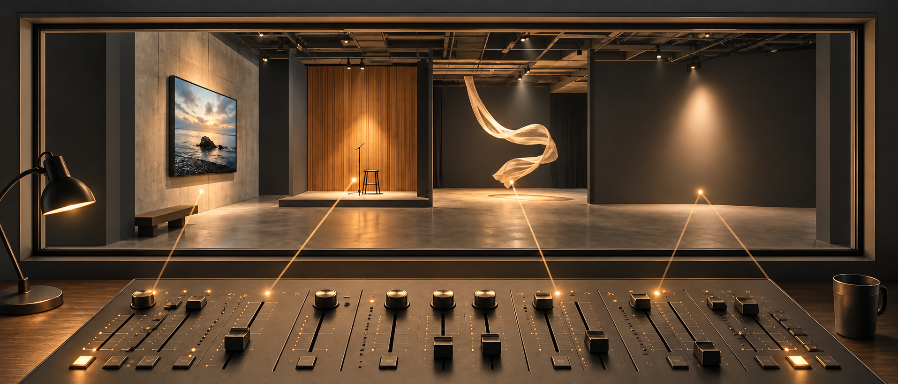

# Movement — Shape how your meaning unfolds

Bring images, speech, sound, and movement together, giving each moment its place and purpose.

[](https://redhead-couple.org/player.php?username=molkho52&project=what-this-project-is)

[▶ Watch “A New Language of Communication”](https://redhead-couple.org/player.php?username=molkho52&project=what-this-project-is)

Movement is an open expressive medium for combining images, narration, sound,
silence, text, timing, effects, and layered movement. Creators arrange these
elements into visual works; contributors extend the medium with reusable
expression tools.

**Movement Public Alpha 0.1** is experimental. Project formats and interfaces
may change, and important work should be backed up.

## Try the live experience

Visit [Early Formation](https://redhead-couple.org/), the website for Movement.
Explore the [public feed](https://redhead-couple.org/feed.php) or start with
[A New Language of Communication](https://redhead-couple.org/player.php?example=what-this-project-is).
The [concept series](https://redhead-couple.org/concept/) introduces the medium
and how people can develop and share new forms of expression.

## Start creating on Windows

The **Movement Timeline Studio Authoring Kit** is the primary way to try
Movement locally. It is a source-visible, no-installer application for
**Windows 10/11 x64**.

1. Open the [Windows download page](https://redhead-couple.org/download.php)
   and check the version available there.
2. Extract the complete ZIP into a writable folder.
3. Run `Movement Timeline Studio.exe`.
4. Explore the read-only Examples workspace, then create your own workspace
   and copy an example into it to begin editing.

Normal authoring and playback do not require PHP, MySQL, a separate Node.js
installation, or an internet connection. Projects live in the kit's
`workspace/` folder; back it up before replacing the extracted application.

**The Windows Alpha build is unsigned.** Windows may show a SmartScreen or
unknown-publisher warning. See the [Authoring Kit guide](docs/DESKTOP_AUTHORING_KIT.md)
for source editing and the distribution boundary.

**Movement Public Alpha 0.1**, version **`0.1.0-alpha.1`**, is available as
[release `v0.1.0-alpha.1`](https://github.com/redhead-couple/movement/releases/tag/v0.1.0-alpha.1).
The [public repository](https://github.com/redhead-couple/movement) contains
the source. Use the Windows download page above for the recommended Authoring Kit.

## Develop from source with Electron

Use a full source checkout and Node.js **22.12 or newer**:

```powershell
git clone https://github.com/redhead-couple/movement.git
cd movement
npm.cmd ci
npm.cmd run desktop
```

If you already have the source, run the npm commands from its root.
On other shells, use `npm` instead of `npm.cmd`.

Run the automated Node suite from the full source checkout:

```powershell
npm.cmd test
```

Some tests execute PHP; install PHP 8.0 or newer with the extensions required
by the [advanced PHP setup](docs/LOCAL_INSTALLATION.md) to run the complete
suite. See [Desktop Development](docs/DESKTOP_DEVELOPMENT.md) for desktop smoke
checks, builds, and the dated verification results.

The repository has **0 direct runtime npm dependencies** and **2 direct
development dependencies**: Electron `43.2.0` and electron-builder `26.15.3`.
Electron is bundled in desktop distributions.

## Advanced: PHP/MySQL self-hosting

The web platform provides accounts, project libraries, media management,
publishing, feeds, and playback. It requires PHP 8.0 or newer, the documented
PHP extensions, MySQL or MariaDB, and a configured web server.

Follow [Local Installation](docs/LOCAL_INSTALLATION.md) for configuration,
database setup, private-storage rules, HTTPS, and local verification. The
[Operating Modes guide](docs/OPERATING_MODES.md) distinguishes the web platform,
desktop application and portable player. Movement Timeline Studio / Windows
Authoring Kit is the supported local Alpha experience.

## Explore and extend the medium

The current registries contain **25 effects** and **6 advanced transitions**:
**31 registered expression tools** in total.

- [Effects registry](effects/registry.json) and
  [transitions registry](transitions/registry.json): current inventory.
- [Effect Authoring Contract](docs/EFFECT_AUTHORING_CONTRACT.md) and
  [Transition Authoring Contract](docs/TRANSITION_AUTHORING_CONTRACT.md):
  requirements for new and updated tools.
- [Flow schema](docs/flow-schema.md): project data format.
- [Engine Catalog](docs/ENGINE_CATALOG.md): partial parameter reference for
  older engines; it does not cover the complete current inventory.
- [Contributing](CONTRIBUTING.md): development, testing, and proposals.

The shared editor and player live in `studio/`; `desktop/` hosts the Electron
application, and root PHP pages plus `server/` implement the web platform.
Bundled examples live in `examples/`.

## Alpha security and community

Movement is experimental Alpha software. The web application includes prepared
database queries, request guards, and upload validation. These controls do not
establish production security assurance; self-hosters must review their
deployment configuration.

Read the [Security Policy](SECURITY.md), [Code of Conduct](CODE_OF_CONDUCT.md),
and [Changelog](CHANGELOG.md). Contributions are welcome through the
[public repository](https://github.com/redhead-couple/movement).

## Names and licenses

**Movement** is the project and medium. **Movement Timeline Studio** is its
desktop application. **Early Formation** is the website and umbrella brand.
**Redhead Couple** maintains and publishes the project.

Source code and accompanying software documentation use the [MIT License](LICENSE).
Bundled images, narration, photographs, icons, and other media are **not
automatically covered by MIT**. Their separate permissions and creator facts
are recorded in [Media provenance and attribution](MEDIA_ATTRIBUTION.md).
